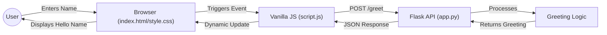

# Greeting Web App

A modern, responsive web application built with Flask and Vanilla JavaScript that provides personalized greetings.

## Architecture



## Features
- **Flask Backend**: Robust Python server handling API requests.
- **Premium Frontend**: Sleek, glassmorphic design with micro-animations.
- **Vanilla JS**: Smooth, no-framework interaction layer.

## Project Structure
- `app.py`: Flask application server.
- `templates/`: HTML templates.
- `static/`: CSS styles and JavaScript logic.

## How to Run

1. **Install Dependencies**:
   ```bash
   pip install flask
   ```

2. **Run the App**:
   ```bash
   python app.py
   ```

3. **Open in Browser**:
   Navigate to `http://127.0.0.1:5000`
